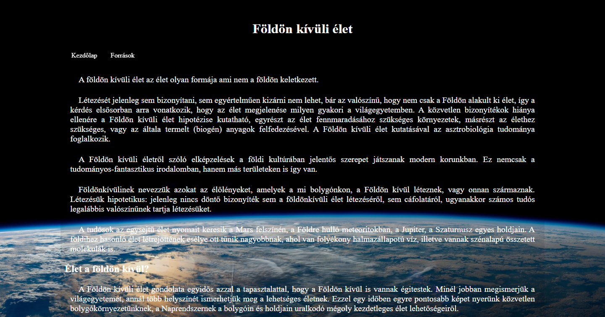
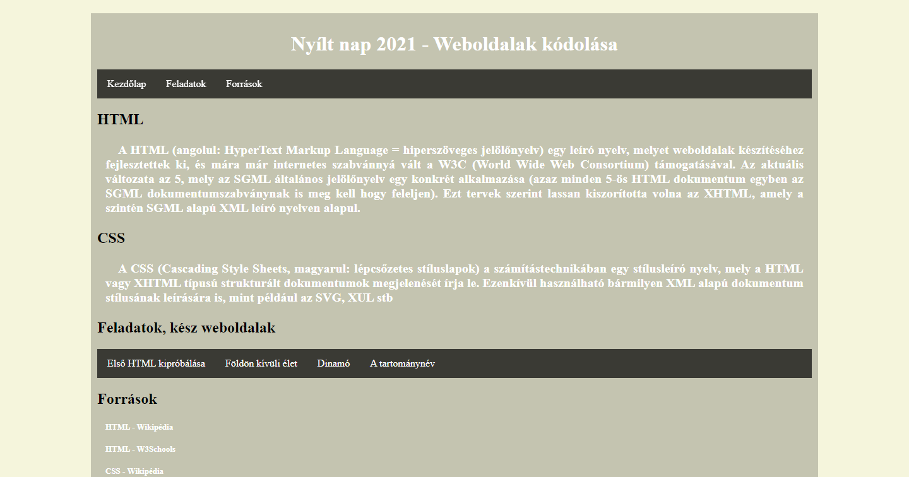
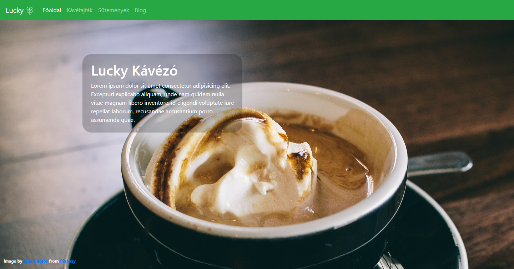

# Portfólió
## Eddig készült saját, illetve csoport weboldalak
## Földön kívüli élet
A Földön kívüli élet című témát egy csapatmunkában dolgoztuk fel. Az ötleteket, a cikkeket az internetről gyűjtöttük. Minden olyan információt közlünk a weboldalban, ami a Földön kívüli életről szóba jöhet. A projektet a csapat tagjaival közösen választottuk a sok-sok feldobott téma közül, azért mert a legérdekesebbnek találtuk ezt a címet. A feladatokat szintén a TRELLO táblán keresztül osztottuk meg, és minden szóba jöhetett információt ott osztottunk meg egymással. A feladat elkészülést validálása után megosztottuk a többi csapattal, majd közösen értékeltük egymás weboldaljait.
### Földön kívüli élet projekt résztvevői:
- Nagy Tibor
- Kiss Lajos Bertalan
- Kolozsvári Krisztián

## Nyílt nap
Saját tervezésű weboldal, amely az iskolai nyílt napra készült bemutatóként. Bemutatja az alap HTML és CSS felépítését, illetve az addig készült weboldalakat is tartalmazza. A diákok ki is tudták próbálni, hogyan tudnak létrehozni és hogyan tudják módósítani a szerkezetét.
### A Nyílt nap projekt résztvevője:
- Kolozsvári Krisztián

## Modern, reszponzív weboldalak
## Lucky kávézó
A Lucky kávézó projektet szintén csapatmunkában dolgoztuk fel. A feladat egy nagyobb lélegzetvételű volt. A feladat elkészítéséhez projekt menedzsert választottunk, majd az elkészítéshez létrehoztunk egy TRELLO táblát, ahol mindenki megtudta osztani a saját ötleteit, elképzelését. A feladathoz meg volt adva egy régebbi weboldal, amely még nem modern, reszponzív oldal volt. Nekünk olyanra kellett varázsolni. A régi képeket kicseréltük újabbra (csak kizárólag Creative-Commons licenc alapú képeket használtunk). Validáltuk a régi oldalt, javítottuk a hibákat, kicseréltük a Lucky logót is. A szabad felhasználású képeket letöltés után egyforma méretre formáztuk. Mindeközben minden információt megosztottunk a Trello táblán mindenkivel. A projektmenedzser folyamatosan figyelte, hogy ne maradjon ki feladat. A feladatok a tagokra nem voltak terhelve, hisz az elején mindenki megkapta a saját feladatát. Majd végül az elkészült Wireframe szabványnak és az egységes menürendszernek megfelelő oldalt szintén validáltuk, ha minden rendben volt, akkor a feladatok késznek tekintettük.
### A Lucky kávézó projekt résztvevői:
- Nagy Tibor
- Kiss Lajos Bertalan
- Kolozsvári Krisztián

[A csapatmunka elérhetősége](https://lali98.github.io/lukcy_kavezo/index.html)

